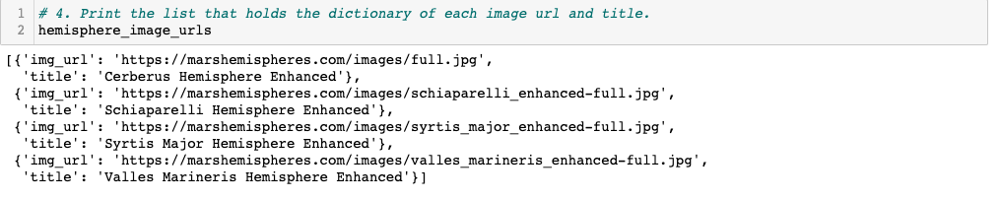
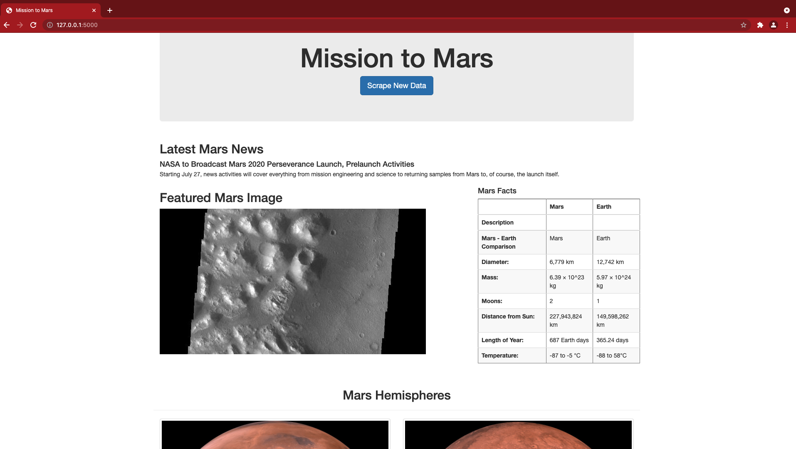
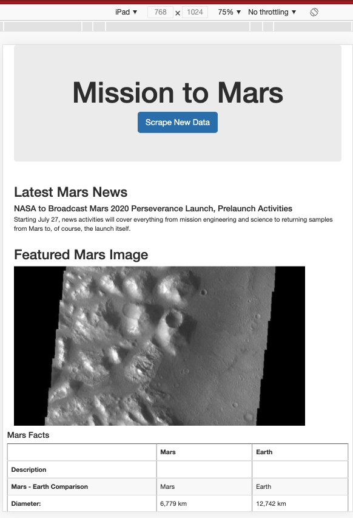
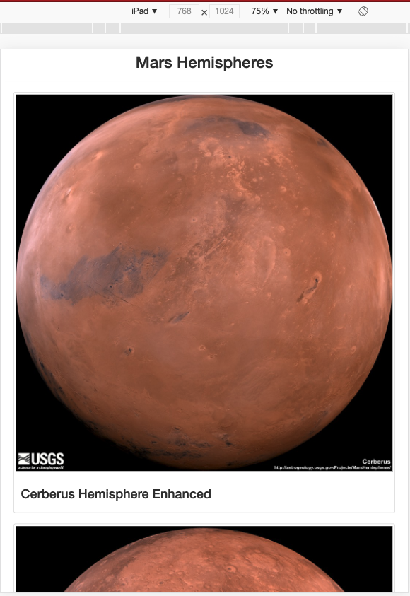

# Mission-to-Mars

## Overview

In this project, we use web scraping to extract information from active websites.

Some of the tools we used from the beginning were:
  - Chrome Developer Tools
  - Beautiful Soup and Splinter
  - MongoDB
  - Flask

We help Robin to gather data about missions to mars from different sources and display it on one website. For that, we created a script to navigate the webpages to collect data automatically storing the information in MongoDB.

# Challenge

### Deliverable 1: Scrape Full-Resolution Mars Hemisphere Images and Titles 

### Deliverable 3: Add Bootstrap 3 Components

